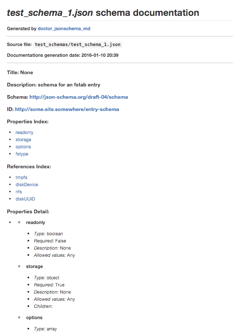

#doctor\_jsonschema_md 
--
A utility script to generate documentation in Markdown format from JSON schema files. 

Transform


```
{
    "id": "http://some.site.somewhere/entry-schema#",
    "$schema": "http://json-schema.org/draft-04/schema#",
    "description": "schema for an fstab entry",
    "type": "object",
    "required": [ "storage" ],
    "properties": {
        "storage": {
            "type": "object",
            "oneOf": [
                { "$ref": "#/definitions/diskDevice" },
                { "$ref": "#/definitions/diskUUID" },
                { "$ref": "#/definitions/nfs" },
                { "$ref": "#/definitions/tmpfs" }
            ]
        },
        "fstype": {
            "enum": [ "ext3", "ext4", "btrfs" ]
        },
        "options": {
            "type": "array",
            "minItems": 1,
            "items": { "type": "string" },
            "uniqueItems": true
        },
        "readonly": { "type": "boolean" }
    },
    "definitions": {
        "diskDevice": {},
        "diskUUID": {},
        "nfs": {},
        "tmpfs": {}
    }
}
```   

Into




